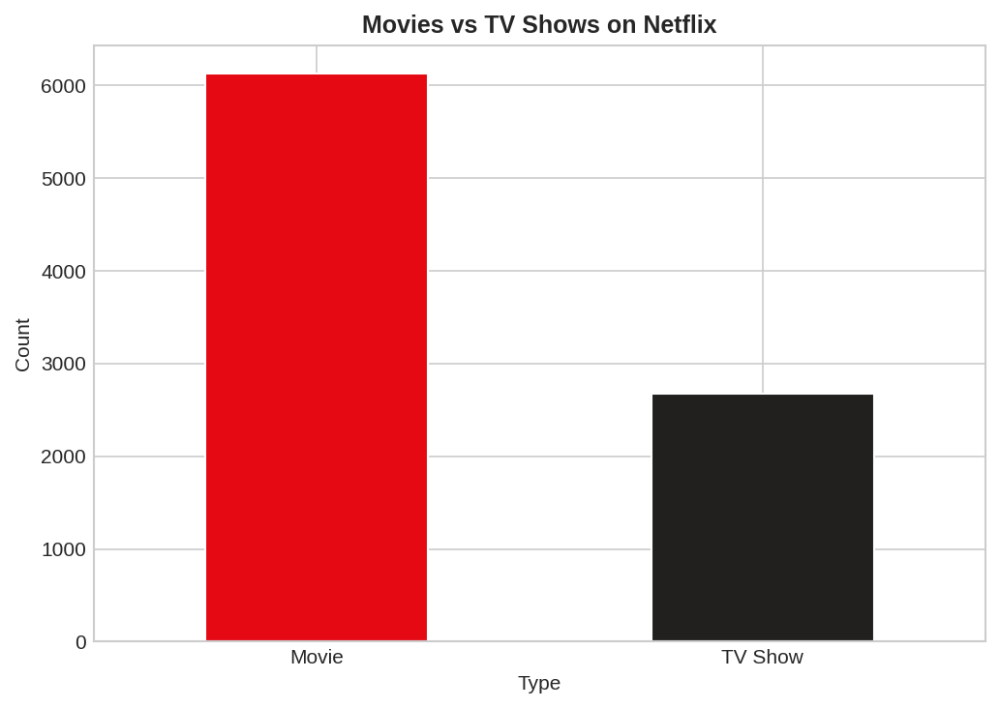
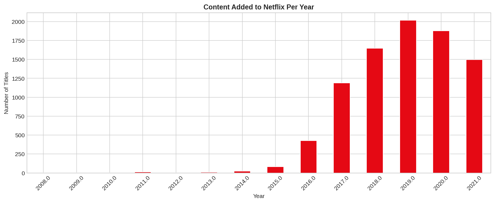
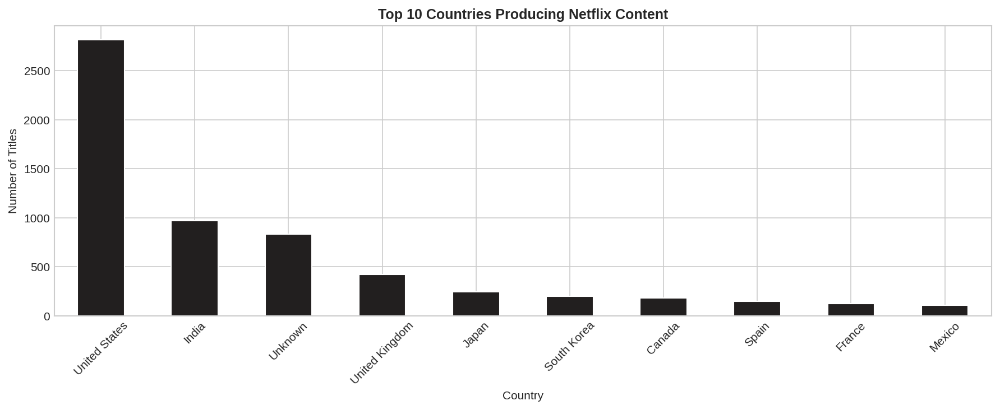
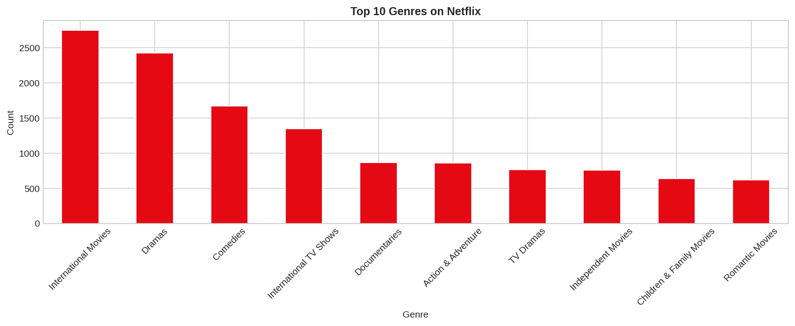
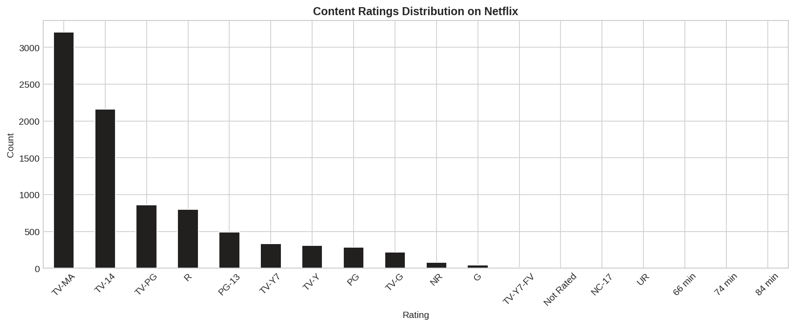
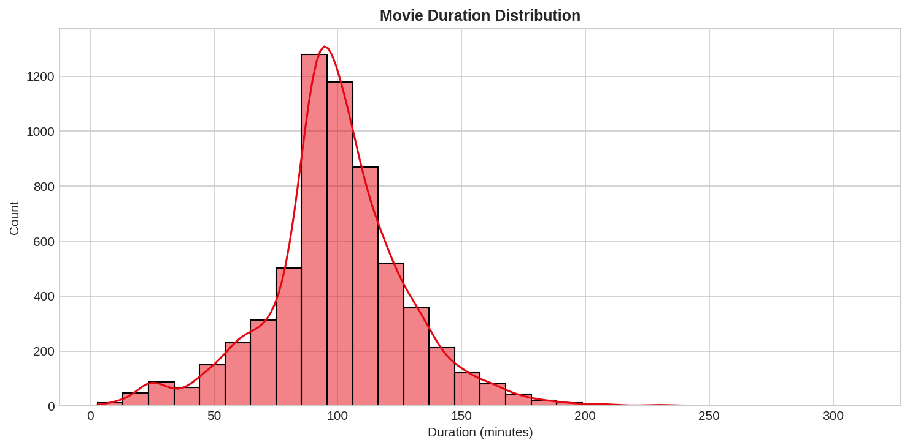

# Task 3 — Exploratory Data Analysis (EDA)
**Synent Technologies Data Science Internship**
**Candidate:** Sil Shah | **Level:** Basic

## Problem Statement
Perform EDA on the Netflix dataset to identify trends and patterns
in content type, genres, countries, ratings and release years.

## Dataset
- **Source:** https://raw.githubusercontent.com/minhaj-313/Netflix-Movies-and-TV-Shows-Dashboard/main/netflix_titles.csv
- **Size:** 8000+ rows × 12 columns
- **Columns:** type, title, director, cast, country, date_added, release_year, rating, duration, listed_in

## Analysis Performed

| Analysis | Insight |
|----------|---------|
| Movies vs TV Shows | Movies dominate Netflix content |
| Content per year | Massive growth after 2015 |
| Top countries | USA produces the most content |
| Top genres | International Movies & Dramas lead |
| Ratings | TV-MA is the most common rating |
| Movie duration | Most movies are 90–120 minutes |

## Key Insights
- Netflix has significantly more Movies than TV Shows
- Content additions grew rapidly between 2015 and 2019
- United States is the top content producing country
- International Movies and Dramas are the most popular genres
- TV-MA is the most frequent rating — majority of content is for adults
- Average movie duration on Netflix is around 90–100 minutes

## Visualizations

## Tools Used
Python · Pandas · Matplotlib · Seaborn · Google Colab
